# Payflow Reliability


A local-first Spring Boot backend that simulates reliability problems commonly found in payment systems: duplicate requests, webhook retries, invalid state changes, settlement mismatches, refund timing, manual review, and auditability.

This project is intentionally small. The goal is not to look senior by adding cloud services, microservices, Kafka, or managed infrastructure. The goal is to show backend judgment around state correctness, failure handling, and operational traceability.

> This is a public-safe educational project based on common payment engineering patterns. It does not use proprietary employer code, architecture, data, naming, business rules, logs, screenshots, or internal workflows.

---

## What This Project Proves

This repo is built to demonstrate practical backend reliability thinking:

- payment intent lifecycle design
- idempotency handling for retried client requests
- duplicate provider webhook detection
- guarded transaction state transitions
- settlement batch creation
- reconciliation mismatch detection
- manual review workflow
- refund timing rules
- audit trail generation
- business-invariant testing
- CI verification with GitHub Actions

The important part is not the framework. The important part is how the system behaves when things go wrong.

---

## Why This Project Matters

Payment systems often fail in boring but expensive ways:

- a client retries the same request and accidentally creates duplicate payments
- a provider sends the same webhook more than once
- a late webhook contradicts the current local state
- a provider report does not match local records
- a refund is requested after settlement or reconciliation
- operators need to understand what happened after the fact

This project models those failure modes in a safe, local, public portfolio repo.

---

## Tech Stack

- Java 21
- Spring Boot
- Spring Web
- Spring Data JPA
- PostgreSQL for local runtime
- H2 for tests
- Maven Wrapper
- Docker Compose
- GitHub Actions

---

## Architecture

```text
Client / Merchant API
        |
        v
Spring Boot Backend
        |
        ├── payment
        │   ├── payment intent creation
        │   ├── idempotency handling
        │   ├── state transitions
        │   └── fake provider webhook handling
        |
        ├── settlement
        │   ├── settlement batch creation
        │   └── settlement batch items
        |
        ├── reconciliation
        │   ├── provider report import
        │   └── mismatch detection
        |
        ├── review
        │   ├── manual review cases
        │   └── review resolution
        |
        ├── refund
        │   ├── refund request
        │   └── refund completion
        |
        └── audit
            └── append-style audit events

PostgreSQL
        |
        ├── payment_intents
        ├── payment_transactions
        ├── settlement_batches
        ├── settlement_batch_items
        ├── review_cases
        ├── refund_requests
        └── audit_events
```

---

## Main Flow

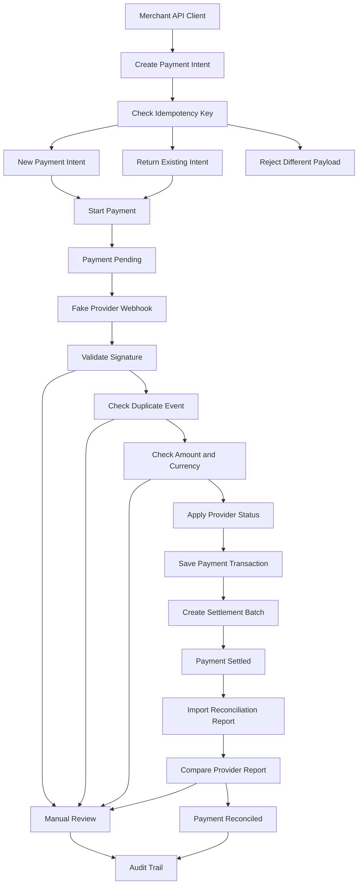

---

## Payment State Machine

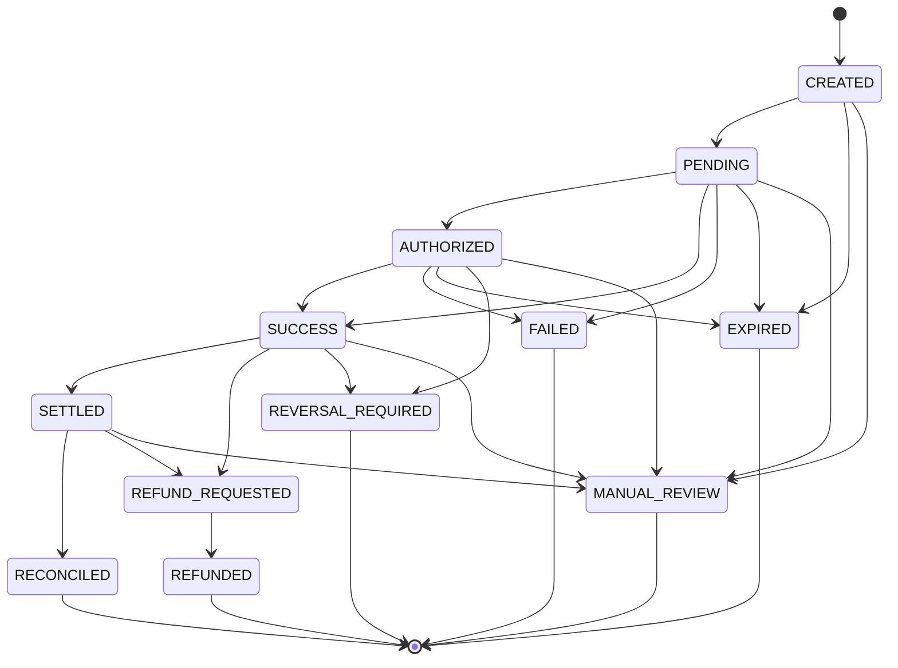

---

## Demo Screenshots

These screenshots show the project as a runnable backend system, not only source code.

| Screenshot | What it proves |
|---|---|
| Repo overview | The project purpose is clear from the first scan |
| CI passing | Tests are continuously verified |
| Demo script output | The full local flow runs end-to-end |
| Idempotency replay | Retried client requests return the same payment intent |
| Duplicate webhook ignored | Provider retry events do not create duplicate transactions |
| Manual review from mismatch | Unsafe provider data is isolated for review |
| Settlement batch | Successful transactions can be grouped and settled |
| Reconciliation mismatch | Provider report differences create review cases |
| Audit trail | State changes and decisions are traceable |
| Local tests | Business invariants are tested locally |

### 1. Repo overview

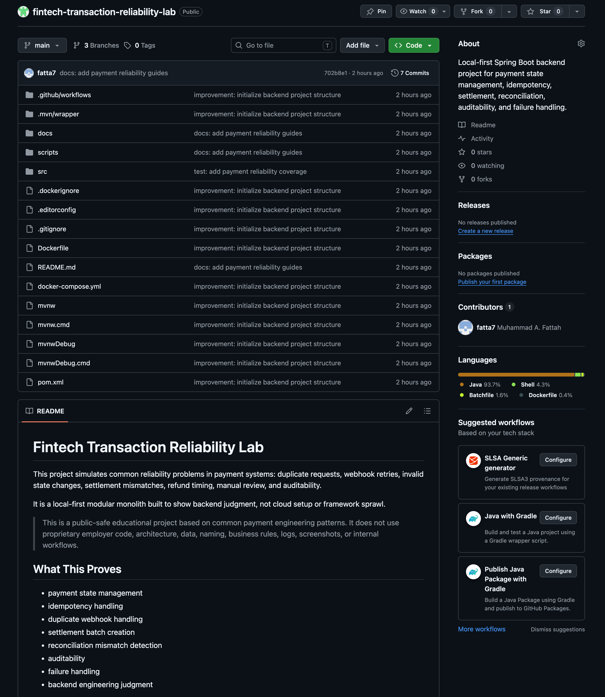

### 2. CI passing

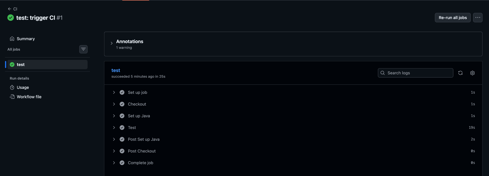

### 3. Demo script output

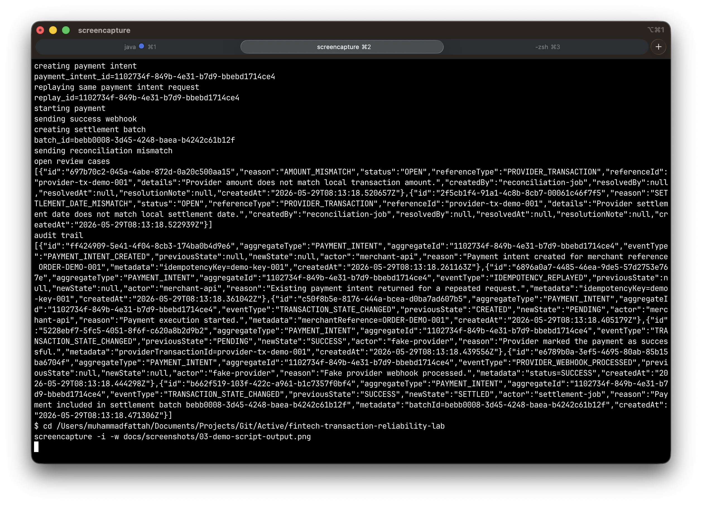

### 4. Idempotency replay

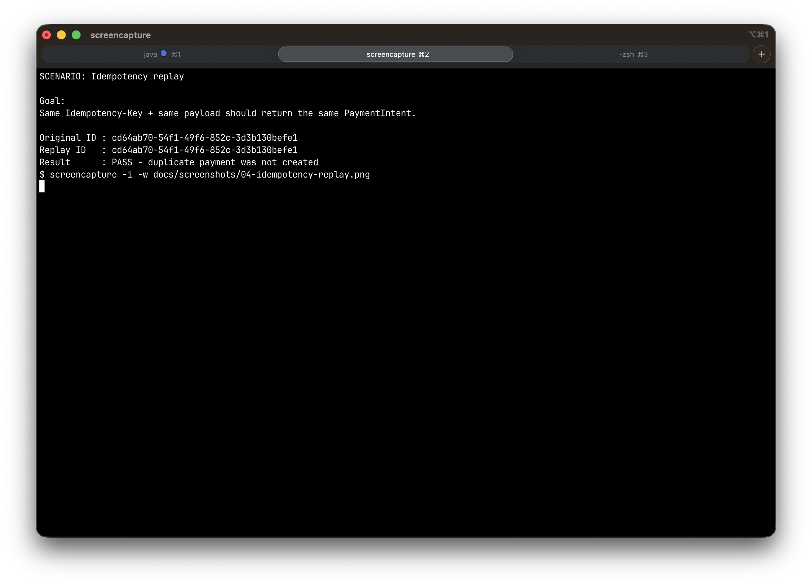

### 5. Duplicate webhook ignored

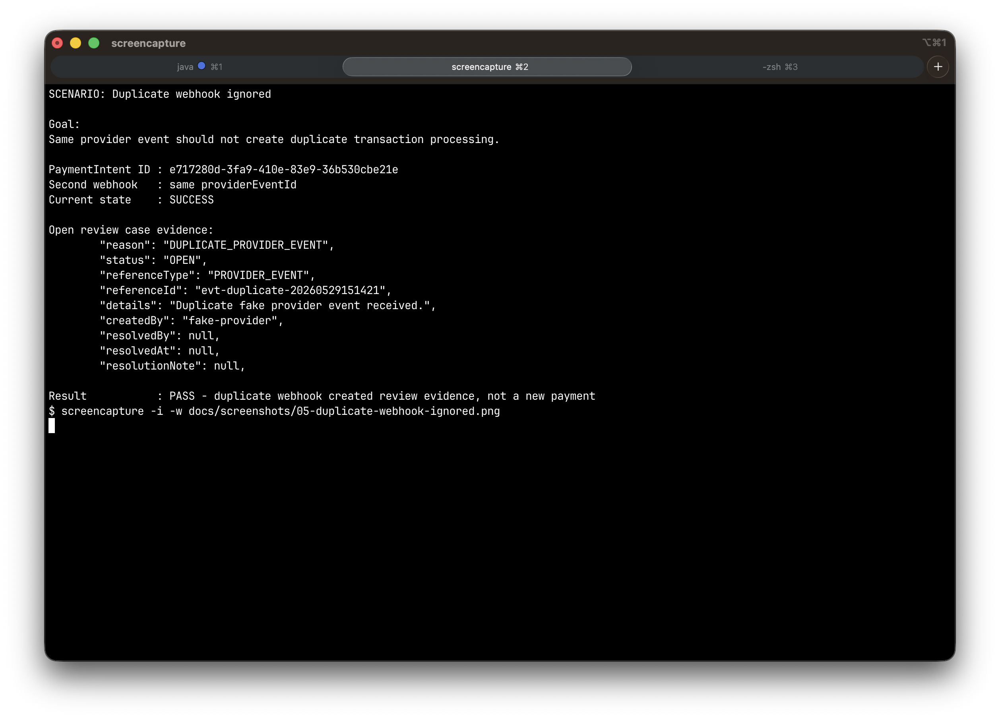

### 6. Amount mismatch creates manual review

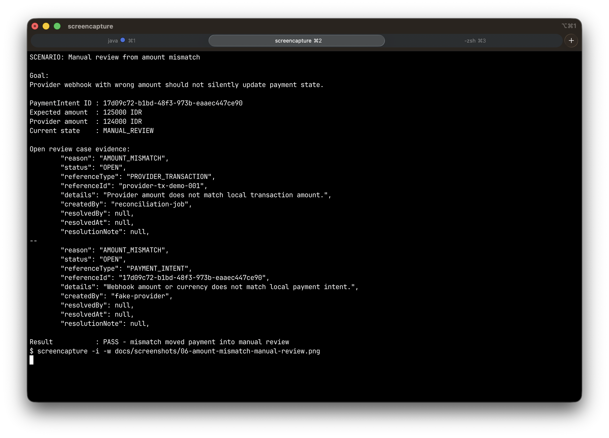

### 7. Settlement batch

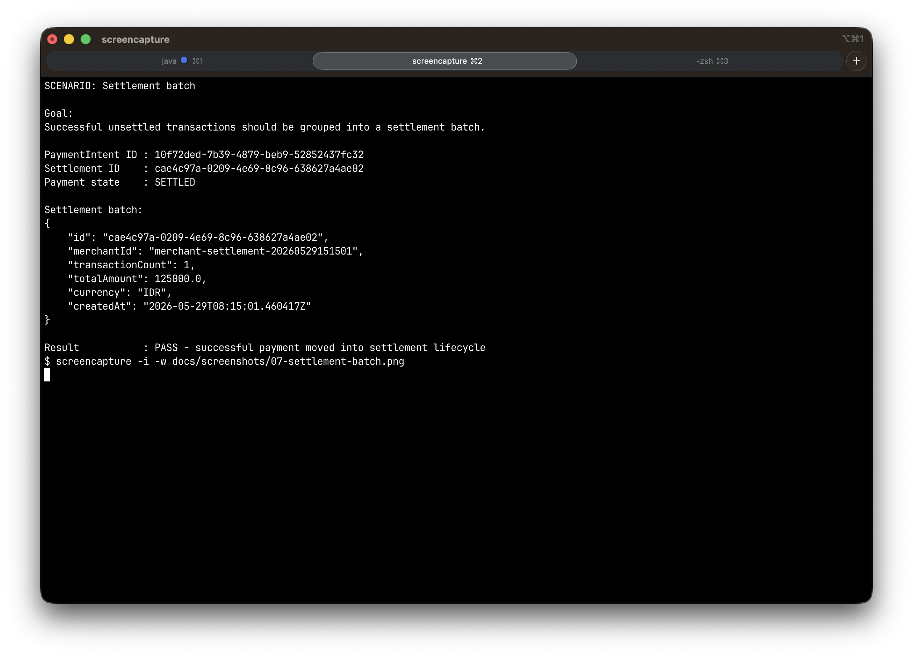

### 8. Reconciliation mismatch

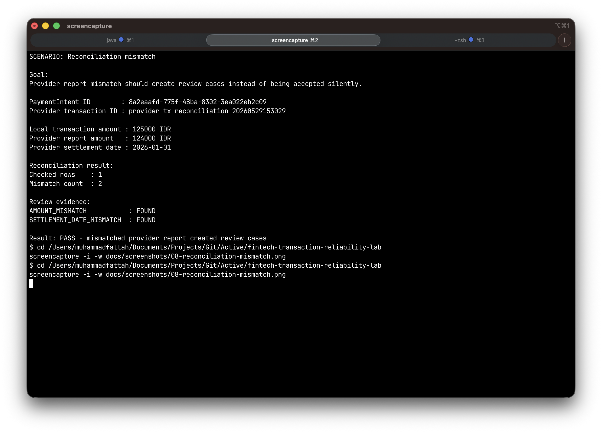

### 9. Audit trail

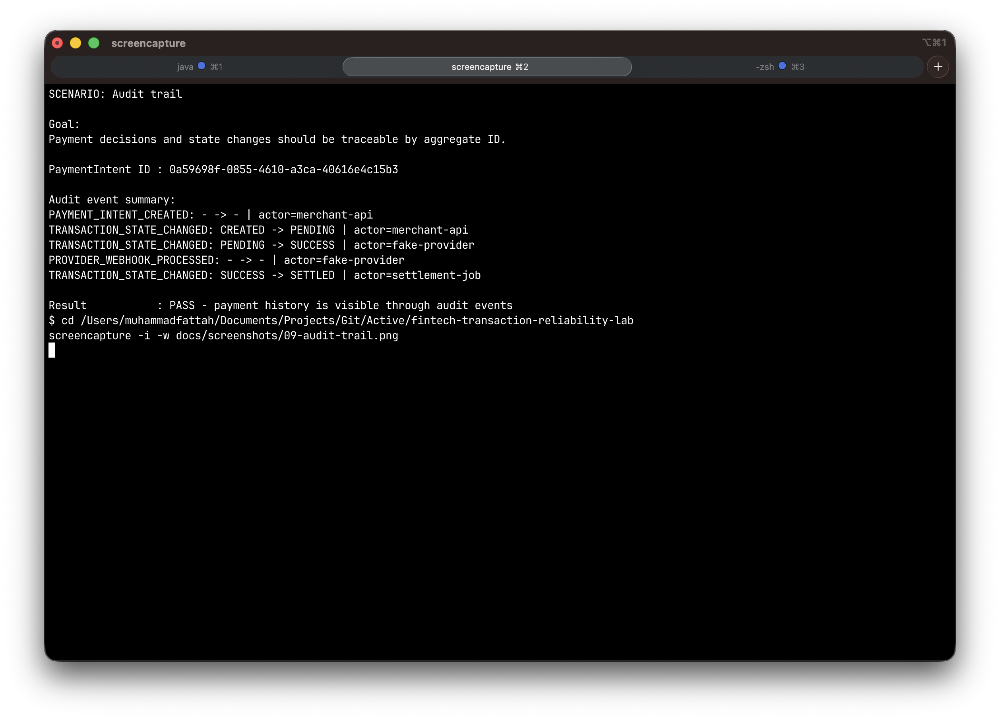

### 10. Local tests

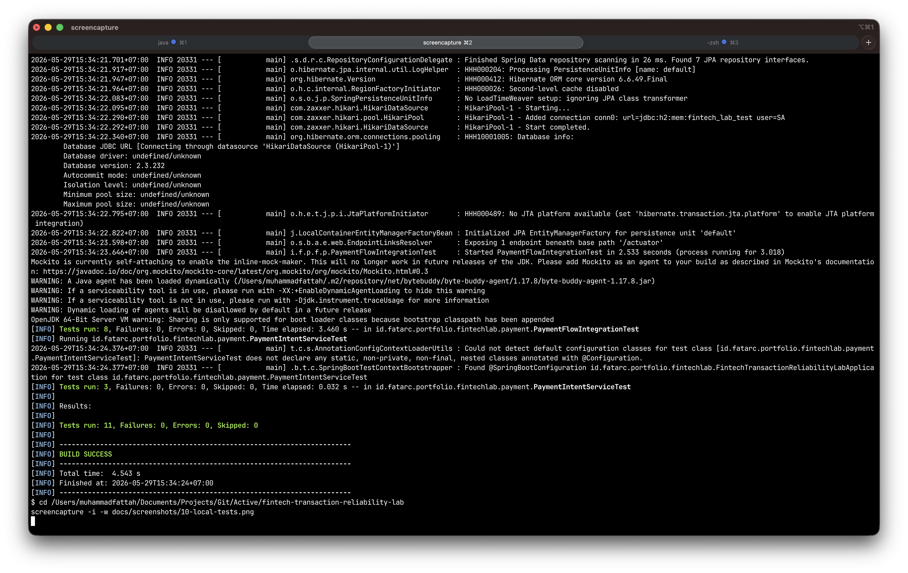

---

## Project Layout

```text
.
├── .github/workflows/ci.yml
├── docs
│   ├── adr
│   ├── demo-flow.md
│   ├── failure-scenarios.md
│   ├── interview-defense.md
│   ├── security-review.md
│   └── screenshots
├── scripts
│   └── demo.sh
├── src/main/java/id/fatarc/portfolio/payflowreliability
│   ├── audit
│   ├── common
│   ├── payment
│   ├── reconciliation
│   ├── refund
│   ├── review
│   └── settlement
└── src/test/java/id/fatarc/portfolio/payflowreliability
```

---

## Local Setup

### Prerequisites

- JDK 21
- Docker
- Maven, or use the included Maven Wrapper

### 1. Start PostgreSQL

```bash
docker compose up -d postgres
```

### 2. Run the app

Using Maven:

```bash
mvn spring-boot:run
```

Or using Maven Wrapper:

```bash
./mvnw spring-boot:run
```

### 3. Health check

```bash
curl http://localhost:8080/actuator/health
```

Expected result:

```json
{
  "status": "UP"
}
```

---

## Run Tests

```bash
./mvnw test
```

The tests focus on business invariants, not only successful HTTP responses.

Current coverage includes:

- same idempotency key returns the original payment intent
- same idempotency key with a different payload is rejected
- missing idempotency key is rejected
- duplicate success webhook is ignored
- contradictory late webhook does not rewrite a successful payment
- amount mismatch creates manual review
- every state change writes an audit event
- settlement marks a payment as settled
- matching reconciliation moves a payment to reconciled
- mismatched reconciliation creates review cases
- refund after reconciliation is blocked

---

## Run Full Demo Flow

The easiest way to see the project behavior is:

```bash
./scripts/demo.sh
```

The demo script performs this flow:

1. create payment intent
2. replay the same request with the same idempotency key
3. start payment execution
4. send fake provider success webhook
5. create settlement batch
6. send reconciliation report with mismatch
7. print open review cases
8. print audit trail

If the script was already run before and fixed demo IDs collide, reset the local database:

```bash
docker compose down -v
docker compose up -d postgres
```

Then restart the app and run the demo again.

---

## API Endpoints

### Payment Intents

```http
POST /api/payment-intents
POST /api/payment-intents/{paymentIntentId}/start
GET  /api/payment-intents/{paymentIntentId}
```

### Fake Provider Webhook

```http
POST /fake-provider/webhook
```

Required header:

```http
X-Provider-Signature: local-demo-signature
```

### Settlement

```http
POST /api/settlements/batches?merchantId=<merchant-id>
GET  /api/settlements/batches
GET  /api/settlements/batches/{batchId}/items
```

### Reconciliation

```http
POST /api/reconciliation/reports
```

### Review Cases

```http
GET  /api/review-cases
POST /api/review-cases/{reviewCaseId}/resolve
```

### Audit Events

```http
GET /api/audit-events?aggregateType=PAYMENT_INTENT&aggregateId=<payment-intent-id>
```

### Refunds

```http
POST /api/refunds/payment-intents/{paymentIntentId}
POST /api/refunds/{refundId}/complete
```

---

## Example Requests

### Create a payment intent

```bash
curl -X POST http://localhost:8080/api/payment-intents \
  -H 'Content-Type: application/json' \
  -H 'Idempotency-Key: payment-001' \
  -d '{
    "merchantId": "merchant-demo-01",
    "merchantReference": "ORDER-1001",
    "amount": 125000,
    "currency": "IDR"
  }'
```

### Replay the same request

Use the same `Idempotency-Key` and the same payload:

```bash
curl -X POST http://localhost:8080/api/payment-intents \
  -H 'Content-Type: application/json' \
  -H 'Idempotency-Key: payment-001' \
  -d '{
    "merchantId": "merchant-demo-01",
    "merchantReference": "ORDER-1001",
    "amount": 125000,
    "currency": "IDR"
  }'
```

Expected behavior:

- the existing payment intent is returned
- a duplicate payment intent is not created
- an audit event is recorded

### Start payment execution

```bash
curl -X POST http://localhost:8080/api/payment-intents/<payment-intent-id>/start
```

Expected behavior:

```text
CREATED -> PENDING
```

### Send a fake provider success webhook

```bash
curl -X POST http://localhost:8080/fake-provider/webhook \
  -H 'Content-Type: application/json' \
  -H 'X-Provider-Signature: local-demo-signature' \
  -d '{
    "providerEventId": "evt-001",
    "providerTransactionId": "provider-tx-001",
    "paymentIntentId": "<payment-intent-id>",
    "status": "SUCCESS",
    "amount": 125000,
    "currency": "IDR"
  }'
```

Expected behavior:

```text
PENDING -> SUCCESS
```

A `PaymentTransaction` is saved.

### Create a settlement batch

```bash
curl -X POST 'http://localhost:8080/api/settlements/batches?merchantId=merchant-demo-01'
```

Expected behavior:

```text
SUCCESS -> SETTLED
```

### Import a reconciliation report

```bash
curl -X POST http://localhost:8080/api/reconciliation/reports \
  -H 'Content-Type: application/json' \
  -d '{
    "rows": [
      {
        "providerTransactionId": "provider-tx-001",
        "amount": 125000,
        "currency": "IDR",
        "providerStatus": "SUCCESS",
        "settlementDate": "2026-01-01"
      }
    ]
  }'
```

If the provider report matches local records, the payment can move from:

```text
SETTLED -> RECONCILED
```

If the report does not match, the system creates a review case.

### View open review cases

```bash
curl http://localhost:8080/api/review-cases
```

### View audit trail

```bash
curl 'http://localhost:8080/api/audit-events?aggregateType=PAYMENT_INTENT&aggregateId=<payment-intent-id>'
```

---

## Failure Scenarios Modeled

### Duplicate client request

A client sends the same create-payment request twice with the same idempotency key.

Expected behavior:

- return the original payment intent
- do not create a duplicate payment intent
- record an idempotency replay audit event

### Reused idempotency key with different payload

A client reuses the same idempotency key but changes amount, currency, merchant reference, or merchant ID.

Expected behavior:

- reject the request
- do not mutate the original payment intent

### Duplicate provider webhook

A fake provider sends the same event twice.

Expected behavior:

- ignore the duplicate
- create a review case
- record an audit event
- do not create a duplicate transaction

### Duplicate provider transaction with new event ID

A provider sends a new event ID but the same provider transaction ID.

Expected behavior:

- treat it as suspicious
- create a review case
- do not create another transaction

### Amount or currency mismatch

A webhook amount or currency does not match the local payment intent.

Expected behavior:

- move payment intent to `MANUAL_REVIEW`
- create a review case
- record an audit event
- avoid unsafe state mutation

### Invalid late transition

A webhook tries to apply a transition that is no longer valid.

Expected behavior:

- do not force the state change
- create a review case
- record an ignored webhook audit event

### Reconciliation mismatch

A provider report does not match local transaction data.

Expected behavior:

- create review cases for mismatches
- record reconciliation audit events
- only reconcile clean matched records

### Refund after reconciliation

A refund is requested after a payment has already been reconciled.

Expected behavior:

- block direct refund
- require manual review
- record the blocked refund attempt

---

## Design Choices

### Modular monolith over microservices

This project is intentionally a modular monolith.

Reason:

- easier to run locally
- easier to test
- easier to understand
- no fake distributed complexity
- better for demonstrating core transaction behavior

### PostgreSQL locally, H2 for tests

PostgreSQL is used for local runtime to keep the project closer to real backend development.

H2 is used for tests to keep feedback fast and simple.

### No cloud deployment

There is no AWS, GCP, Azure, managed database, hosted queue, or paid observability.

Reason:

- no billing risk
- no secret management problem
- easier for reviewers to run
- portfolio value comes from correctness, not hosting

### Fake provider instead of real gateway

The provider webhook is simulated.

Reason:

- avoids sensitive payment integrations
- avoids compliance concerns
- keeps the project public-safe
- focuses on reliability behavior

### Audit trail as a first-class concept

State changes and important decisions are recorded as audit events.

Reason:

- payment systems need traceability
- debugging requires historical context
- manual review needs evidence
- operators need to know why a state changed

---

## Documentation Map

- [Demo Flow](docs/demo-flow.md)
- [Failure Scenarios](docs/failure-scenarios.md)
- [Security Review](docs/security-review.md)
- [Interview Defense](docs/interview-defense.md)
- [Architecture Decision Records](docs/adr)

---

## Continuous Verification

GitHub Actions runs on:

- push to `main`
- push to `dev`
- push to `dev/**`
- pull requests into `main`
- pull requests into `dev`

The workflow:

1. checks out the repository
2. sets up Java 21
3. caches Maven dependencies
4. runs tests with `./mvnw test`

No deployment, registry publish, artifact publish, or scheduled workflow is included.

---

## Limitations

This project does not:

- process real payments
- connect to a real payment gateway
- store card data
- implement PCI-DSS compliance
- represent any employer system
- use proprietary architecture, data, logs, naming, or workflows
- model distributed locking
- model queue-based retries
- model multi-region behavior
- implement real authentication or authorization
- implement production-grade observability

These omissions are intentional.

---

## What To Review First

For recruiters or engineers reviewing this repo quickly:

1. Run `./scripts/demo.sh`
2. Check the state machine diagram
3. Check the test suite
4. Check `PaymentIntent`
5. Check `ProviderWebhookService`
6. Check `SettlementService`
7. Check `ReconciliationService`
8. Check the audit and review flow

The core idea: this is a small backend system built around safe payment-state handling, not a generic CRUD tutorial.
